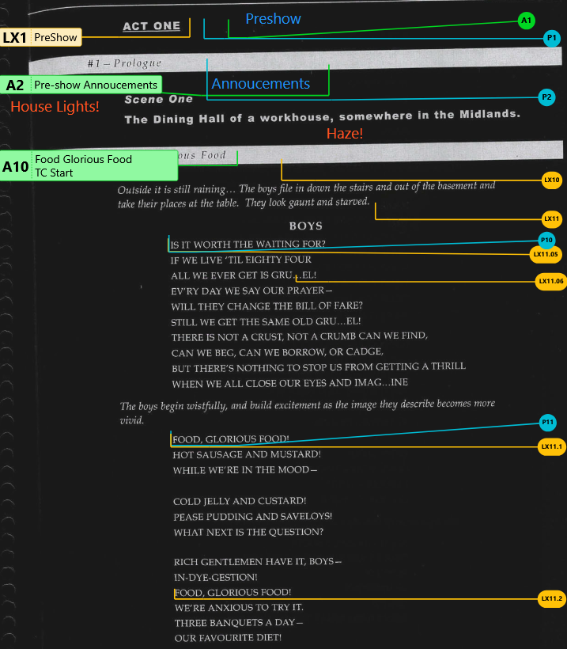
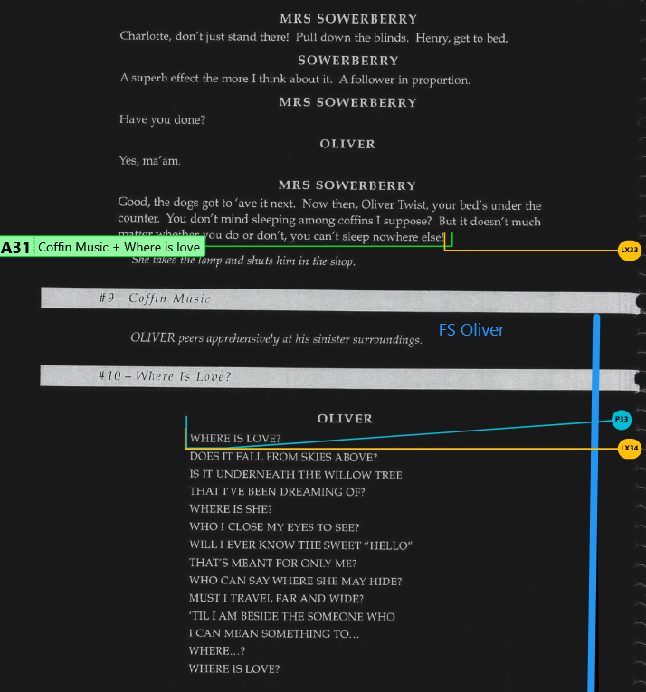

## Script Software
I use [CuePad](https://cuepad.app) as my main app for doing scripts.
It works on anything with a web browser (very handy with an iPad), lets you draw on the script, create cues and then export them out as a spreadsheet so you can import it into a lighting desk to speed things along!
Other handy features:
* Lets you collaborate on a script with other people
* Has layers for different types of cues (Lighting/Sound/Blocking etc)
* Can be exported to PDF
* Sort-of Free - Limited to 1 Active Script at a time, no export option unless paid.  But only one person on your team needs to pay for it.
* Supports Dark Mode (Allows you to convert a Black on White script to White on Black)

### Other options
**Google Docs** (Any device - Free)
Can still share with others, but the only way to layer on your cues is to use Drawing Objects and they're a pain to use.

**Microsoft Word** (Any Device - Paid)
Using Text Boxes layered on top works reasonably well, just need to be wary if you change the script that your marks still line up!

[**Scriptation**](https://scriptation.com) (iPad/Mac - Free & Paid)
Works best with an Apple Pencil - if you hand write all your cues it's really solid.  I have used this for a few shows.  It gets a little bit slow when you have a lot of writing on the page.

**Preview** (iPad/Mac)
This is more of just a PDF viewer, but on an iPad with the Apple Pencil you can mark up your script or drop in text boxes/hightlight parts. 

**Pen and Paper**
The old fashion way of doing it.
No collaboration - but very reliable, until of course you forgot your script at home...

## Marking up Scripts
Everyone has their own way of marking cues and notes on a script - but here's my process - this is using CuePad on an iPad with an Apple Pencil, but the idea is about the same with any software/show!

1. Watch through a rehearsal of the show (Usually, I'll set up a camera to record this) and handwrite notes for general feels/vibes or lighting ideas as I go.
I usually use Yellow for Notes/Ideas.
**TODO: Pic Here**

2. Next watch through of the rehearsal video - Start/Stopping as I add in each cue. Using CuePad is a little slower than just handwriting the cues, but if you enter them in properly first time - you can export straight to the lighting desk. 
Each Cue should have: 
    * Cue Number (See below for more on this)
        - EG.  LX1.5 
    * What you want the cue to do
        - EG. "Spotlight on Mr Biggles - Upstage OP Side"
        - You also might want to note how fast it happens to - Eg. Slow Fade in wash lighting (3sec)
    * When you want the cue to fire
        - EG. "As Curtains Open"
        - This isn't always necessary as the mark point on the script might be in the right spot for it, or it may be an automatic cue that follows after another cue.

3. Once I've got all my cues sorted, I'll usually export as a CSV file, adjust the file to upload to the lighting desk and it'll pre-populate all my cues ready to program!

## Cue Numbers
Cues are usually labelled with the Cue Type and a Number.
Here's the standard labelling for cue types
* LX - Lighting
* MQ - Music Cue
* SQ - Sound Cue
* SFX - Special Effects
* PR - Projection/Media Cue
* Q - Blocking Cue
* PRO - Prop Note
* CST - Costume Note
* SC - Scene/Set Note
* DIR - Director Note
* GN - General Note

Then a unique number follows this - the cues will ALWAYS be in order counting upwards!

If it's a small show, you can just count upwards. LX1, LX2, LX3.

If you realise later you need a cue between 1 and 2, you would use a decimal, like LX1.5

There are limits to how deep you can go with decimal points! The EOS lighting desk will let you go as far as 1.111  (3DP)

For a full show, I'll do each scene in multiples of 10 - Scene 1 = LX10 to LX19.  Scene 2 is LX20 to LX29 and so on.  I'll break the scenes up into chunks, so if there's 2 songs in a scene, it may be all the cues of one song are LX12.01 to LX12.99, then some dialogue inbetween using LX13-LX15, and the next song being LX15.01 to LX15.99.

It's okay to skip chunks of numbers! I usually put the very last cue of a scene as high as I can within that scene - So for Scene 2 (LX20 to LX29). The black out cue at the end of the scene is LX29).

If you want to repeat a cue, add it as a new cue (so the numbering still fits) and in the description of the cue you'd say "Same as Cue LX2.5"

## Other Little Tips
### Automated Cues
If I'm running a show with a lot of automated cues or a cue that triggers multiple things, I'll have the cues you need to actually press the button in the script listed with a "Notation" cue marker, and the other cues are just the small Circle Cue markers.
Eg.  Here's the start of a show - There's 14 Cues on this one page. But only 3 of them you actually need to press the go button for, the rest are either tied in with that cue to run at the same time, or timecoded to go with the music automatically.
This way you can see the cues are there, but you don't have to think about them when actually running the show.

### Follow Spot Cues
I use a moving light manually controlled as a follow spot, so I'm often running the cues and driving the follow spot at the same time.
I mark my follow spot as notes and a big blue line down the side of the page noting who I'm following.

